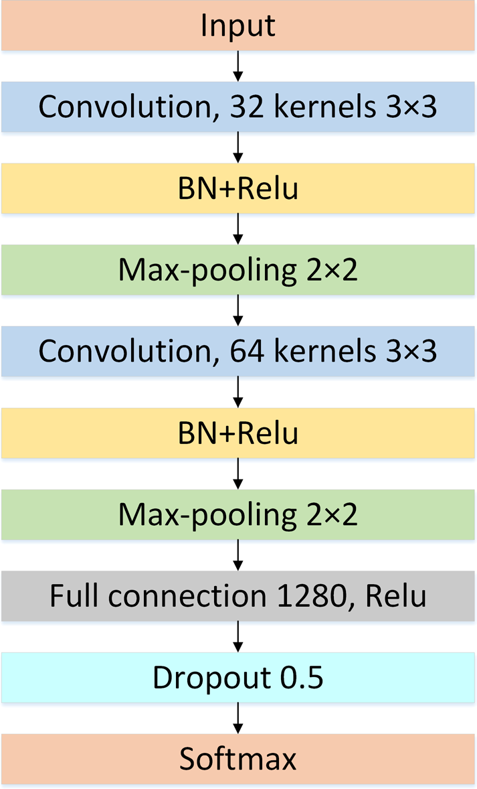
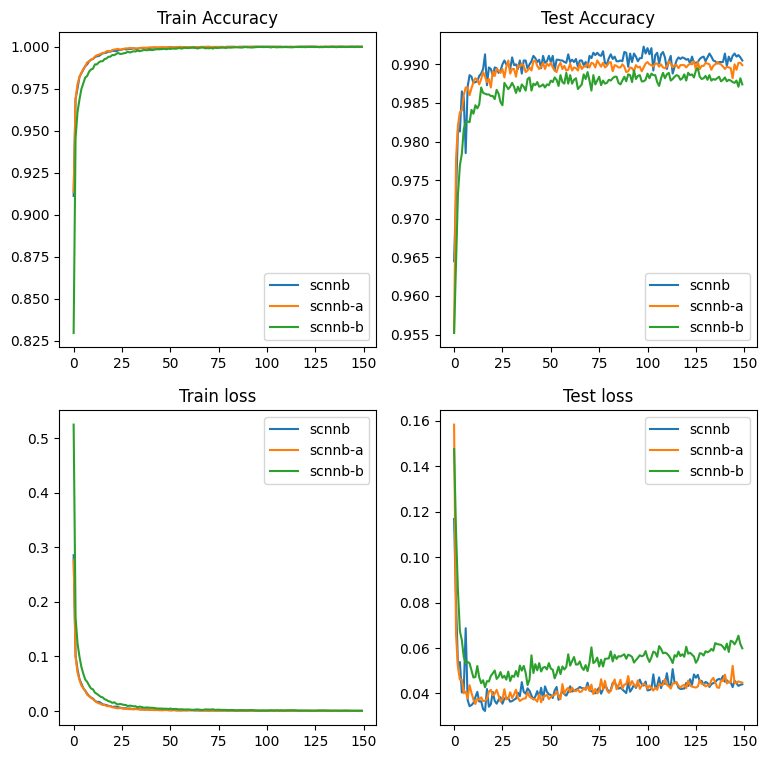

# Neural Networks & Deep Learning - Computer Assignment #2 - Fall 2022
## University of Tehran
### Convolutional Neural Networks

* Q1: Shallow Convolutional Neural Networks for Classification

* Q2: CNN Model for Image Classification on XRay dataset

